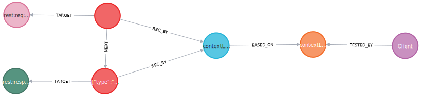
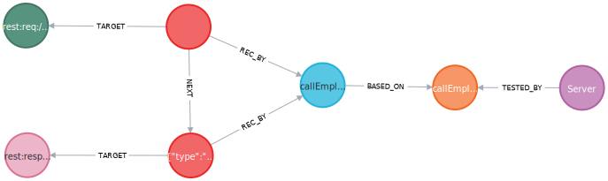
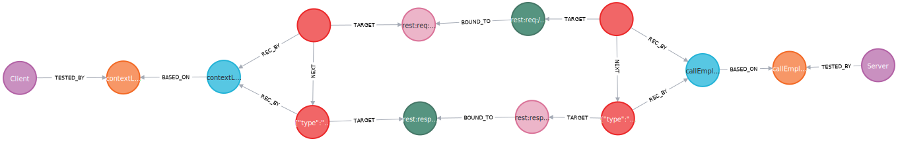

# Iterative Integration Testing Demonstration
This repository is meant to describe how the iterative integration testing process can be automated. It is based on the Spring guide to consume REST Services(client) (https://github.com/spring-guides/gs-consuming-rest) and the related Quote Service(server) (https://github.com/spring-guides/quoters).

## Modifications to the projects
For the client, unit tests using the *MockRestServiceServer* as a mock for the actual Quote server were added to ensure that some quote is written to the log on application startup.
For the server, we added tests that check that the "/api/random" interface returns a response containing a "success" *type* and a quote with an *id* and a non empty *quote* string.
To capture the REST interfaces and messages during test execution of the client a modified *RestTemplate* Bean is used and configured to use a *BufferingClientHttpRequestFactory* such that an *ClientHttpRequestInterceptor* can be used to capture the requests sent from the client to the server and responses from can be captured and modified.

RestTemplateCustomizer:

    @Component
    public class RecordingRestTemplateCustomizer implements RestTemplateCustomizer {
    
        @Override
        public void customize(RestTemplate restTemplate) {
            //add a BufferedClientHttpRequestFactory to capture the contents and keep the buffer intact
            if(!(restTemplate.getRequestFactory() instanceof BufferingClientHttpRequestFactory)){
                restTemplate.setRequestFactory(new BufferingClientHttpRequestFactory(restTemplate.getRequestFactory()));
            }
            //Register the interceptor to capture the requests and responses
            if(restTemplate.getInterceptors().stream().noneMatch(it -> it instanceof RestTemplateRecordingInterceptor)) {
                restTemplate.getInterceptors().add(new RestTemplateRecordingInterceptor());
            }
        }
    }

Interceptor:

    public class RestTemplateRecordingInterceptor implements ClientHttpRequestInterceptor {

        @Override
        public ClientHttpResponse intercept(
                HttpRequest request,
                byte[] body,
                ClientHttpRequestExecution execution) throws IOException {
            //capture the request to the server
            Recording.getInstance().recordMessage(RecordedMessage.Direction.OUTGOING, "rest:req:"+request.getURI(), new String(body, StandardCharsets.UTF_8));
            //replace the response if necessary
            ClientHttpResponse response = Recording.getInstance().getEnvironmentResponse(execution.execute(request, body));
            InputStreamReader isr = new InputStreamReader(
                    response.getBody(), StandardCharsets.UTF_8);
            String respBody = new BufferedReader(isr).lines()
                    .collect(Collectors.joining("\n"));
            //capture the server response
            Recording.getInstance().recordMessage(RecordedMessage.Direction.INCOMING, "rest:resp:"+request.getURI(), respBody);
            return response;
        }
    }

For the server, a servlet *Filter* is used to capture responses and capture and modify the requests.

    @Component
    public class RecordingFilter implements Filter {
    
        @Override
        public void doFilter(
                ServletRequest request,
                ServletResponse response,
                FilterChain chain) throws IOException, ServletException {
    
            //replace the request if necessary
            HttpServletRequest req = Recording.getInstance().getStimulus((HttpServletRequest) request);
            HttpServletResponse res = (HttpServletResponse) response;
            //record the incoming message
            Recording.getInstance().recordMessage(RecordedMessage.Direction.INCOMING, "rest:req:"+req.getRequestURI(), req.getReader().lines().collect(Collectors.joining(System.lineSeparator())));
            ByteArrayOutputStream baos = new ByteArrayOutputStream();
            final PrintStream ps = new PrintStream(baos);
            chain.doFilter(request, new HttpServletResponseWrapper(res) {
                @Override
                public ServletOutputStream getOutputStream() throws IOException {
                    return new DelegatingServletOutputStream(new TeeOutputStream(super.getOutputStream(), ps)
                    );
                }
                @Override
                public PrintWriter getWriter() throws IOException {
                    return new PrintWriter(new DelegatingServletOutputStream (new TeeOutputStream(super.getOutputStream(), ps))
                    );
                }
            });
            //Capture the response
            Recording.getInstance().recordMessage(RecordedMessage.Direction.OUTGOING, "rest:resp:"+req.getRequestURI(), baos.toString());
        }
    }

## Test execution

First, the unit tests for both components are executed. The captured interfaces, messages, abstract test cases (class+method), concrete test cases (class+method+"unit tests") and the component meta data ([client/server]+"1.0.0") are stored in a neo4j database in a schema corresponding to the TCCII meta-model.

Green: Incoming Interfaces, Rose: Outgoing Interfaces, Purple: Components, Orange: Abstract Test Cases, Blue: Concrete Test Cases, Red: Messages

This results in an interaction expectation from the client. If it calls the "/api/random" endpoint it expects to receive a quote. The two TCCII-Component models are merged to a TCCII-System model.

Next the test of the server can be re-executed but this time the interaction test flag is set that tells the test harness to first query the neo4j database for alternative requests for the "/api/random" interface. It will receive the one sent by the client in its unit test. When the test is executed the servlet *Filter* exchanges the original request defined in the unit test case with the one the harness retrieved from the neo4j database. The request and response will be stored once again.
Next the clients test can be re-executed using the interaction test flag. Yet again the test harness will request alternative responses for requests to "/api/random" from the neo4j database. It will receive the response sent by the server in the interaction test before. This time the mock will send this response by replacing the response that was set within the original test case.
Without any additional modification of the client or server the interaction expectation of the client is verified as all tests are successful.

## Introducting and Detecting defects

We can now introduce defects to either of the two components. E.g. We can introduce an interface fault. We modify the *Quote* class of the client to not contain the *type* and configure the *JSONSerializer* to not ignore unknown fields. Now the unit test is modified to mock quotes without the *type* field such that they are successful. However this does not change the request to the "/api/random" interface that is captured during test execution and will thus result in an interaction test for the server that responds in the same way as before: A quote with the *type* field. The interaction test for the client that uses that response fails with an *UnrecognizedPropertyException* as the *type* field can not be de-serialized.

Another modification would be to change the request URL either on the client or server side. In both cases we detect a missing/extra function fault by querying the neo4j database as the interfaces that are captured during test execution will not be bound.